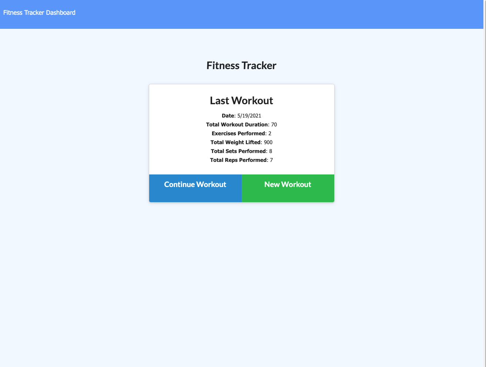
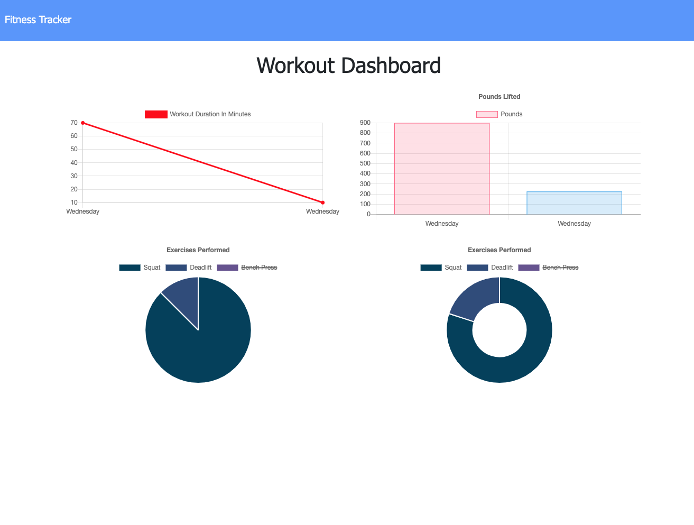
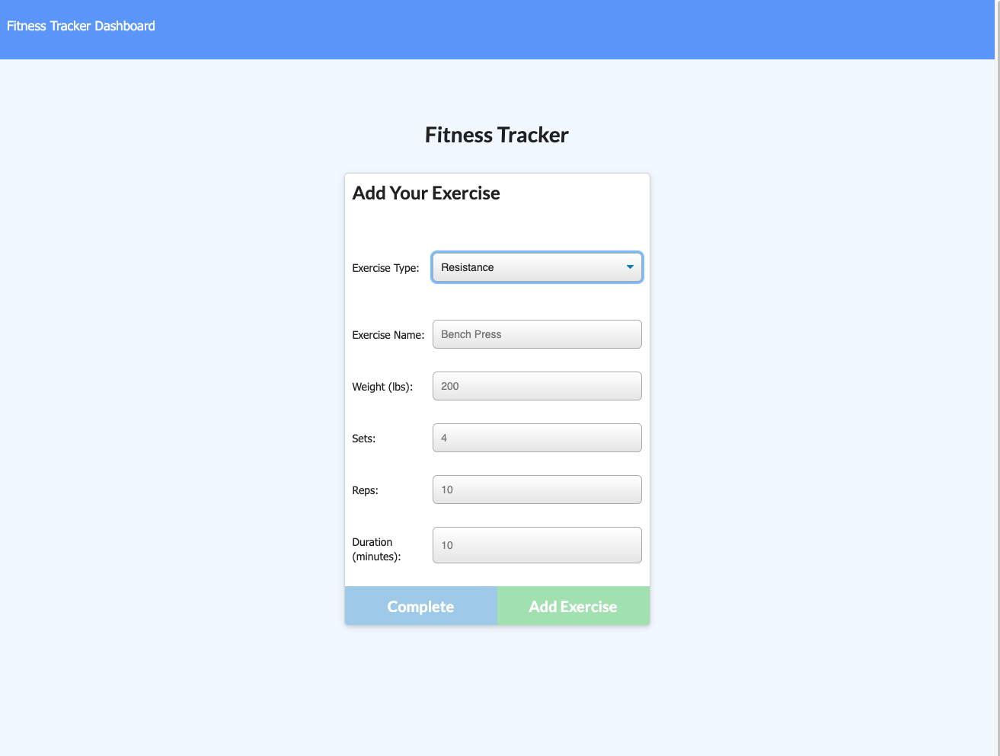

# Get Fit!
Track workouts and exercises to drive results in the gym!
## Table of Contents
- [Usage](#usage)
- [Installation](#installation)
- [Technologies](#technologies)
- [Visuals](#visuals)
- [Authors](#authors)
## Usage
To view the deployed app, and use it fully, [visit the app!](https://safe-ocean-05064.herokuapp.com/)
## Technologies
This app is built with an HTML and CSS front end, with a JavaScript/Node/Express backend, and a MongoDB database.
## Visuals

Running Tests

Using the interface

## Authors
[Luc Burns](https://github.com/lbburnsy)